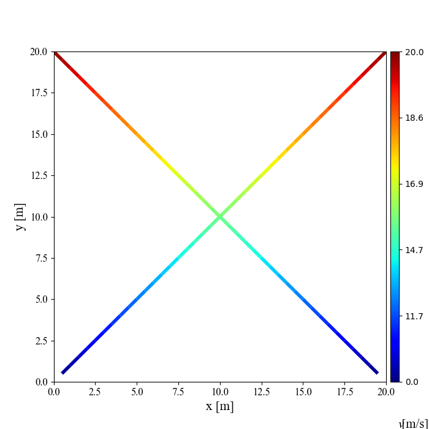
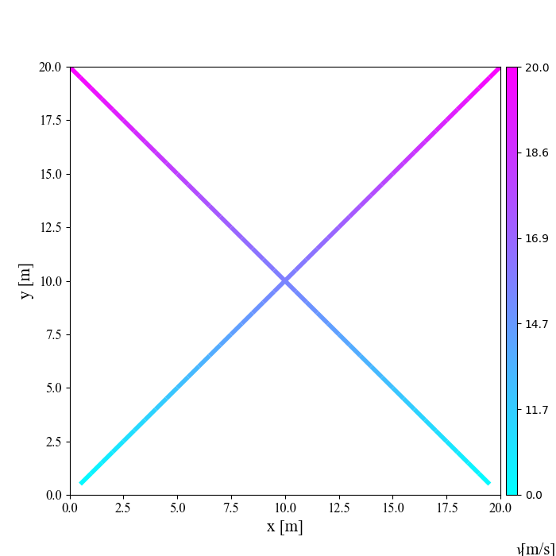
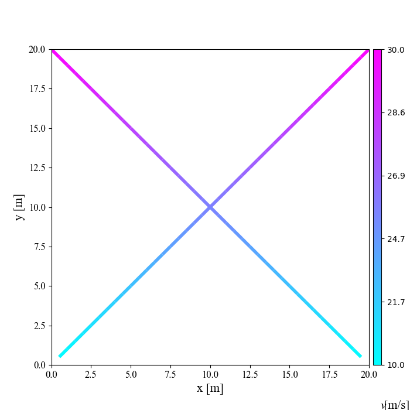
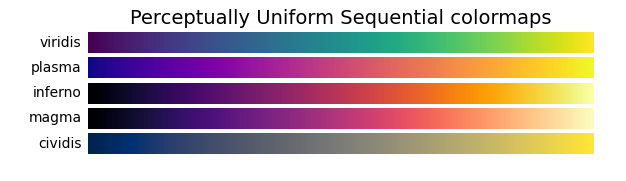
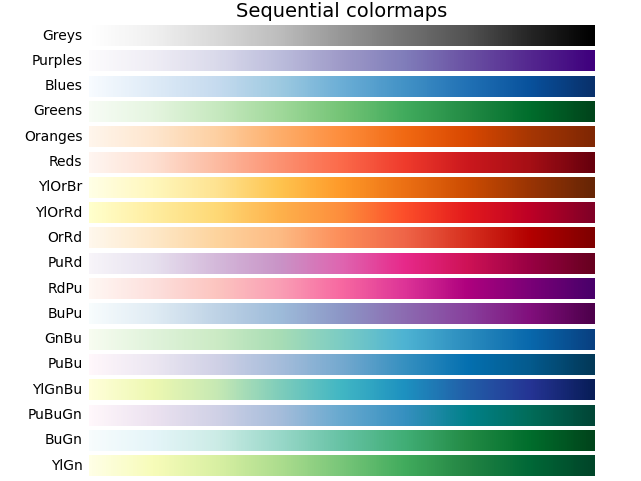
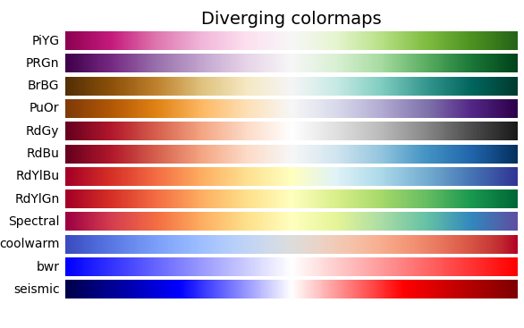
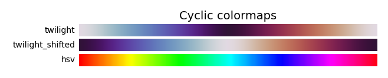
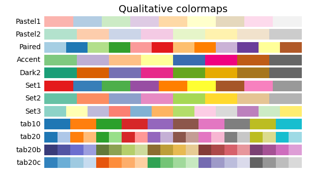
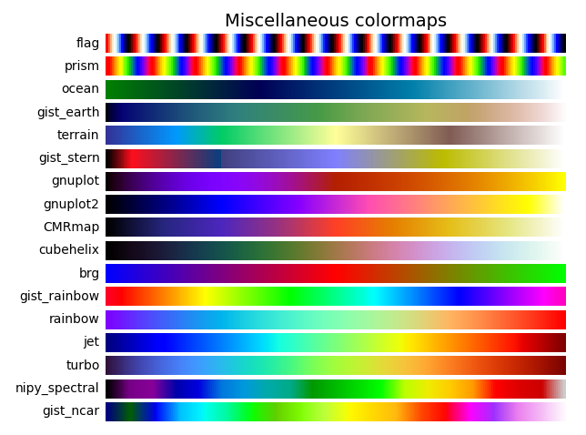

# Draw Gradient Color Map using python

## Dependencies
1. pandas
2. matplotlib
3. numpy
4. seaborn

You can configure it using `pip install XXX` in terminal.

## Results
figure1:  

figure2:  

figure3:  

## Using and Explanation
### 1.改变颜色的种类
在程序`path_Results.py`文件中，修改`plot_results_path`函数中的：

    lc = gd.colorline(x, y, z, cmap=plt.get_cmap('cool'), linewidth=linewidth_car)  # 'jet' #'cool'

中的`cmap=plt.get_cmap('cool')`参数即可。可以设置的有：
参考 [matplotlib tutorials中的colors部分](https://matplotlib.org/tutorials/index.html)
 
举例： 

### 2.改变图例的标注范围
可以进行图例colorbar刻度的调整，包括平移和比例放缩： 
在程序`path_Results.py`文件中，`plot_gd_bar`函数中的：

    def plot_gd_bar(fig, ax, lc, max_pro, max_tran=0, cars_num=1, car_num=0, offset=0):

参数： 
`max_pro`: 调整比例 
`max_tran`: 调整偏移量 
比如`main.py`中函数调用的时候:  

    cb = paths.plot_gd_bar(fig, ax, lc, result0[-1, 2], 10)
     #最后两个参数一个是调整比例，一个是调整偏移量

比例放缩的含义：原本[0,5]可以调整为[0,10]，在上面函数调用中的`result0[-1, 2]`处写上`2`即可； 
平移的含义：原本[0,5]可以调整为[2,7]，在上面函数调用中的`10`处写上`2`即可。
具体效果可以看figure2和figure3的对比，偏移了10个单位。

## Steps:
### 1.load CSV files

    result0 = pd.read_csv("mp_1.csv")
    result1 = pd.read_csv("mp_2.csv")
    result0 = result0.values
    result1 = result1.values

the file:   
first row: x data  
second row: y data  
third row: z data, which is to set the gradient color map.  

### 2.set the size of map and the limits of x axis and y axis

    #设置画布
    width_img = 5
    height_img = 5
    fig = plt.figure(figsize=(int(width_img)+2, int(height_img)+2),
                 facecolor='none')
    ax = plt.gca()
    #设置图像上下界
    plt.xlim(0,20)
    plt.ylim(0,20)  

### 3.draw color map 

    lc = paths.plot_results_path(result0,4)
    lc2 = paths.plot_results_path(result1, 4)

### 4.draw colorbar
可以进行图例colorbar刻度的调整，包括平移和比例放缩： 
比例放缩的含义：原本[0,5]可以调整为[0,10]，在下面函数调用中的`result0[-1, 2]`处写上`2`即可； 
平移的含义：原本[0,5]可以调整为[2,7]，在下面函数调用中的`10`处写上`2`即可； 

    cb = paths.plot_gd_bar(fig, ax, lc, result0[-1, 2], 10)
     #最后两个参数一个是调整比例，一个是调整偏移量

**Notice**:  
以上方便修改和调整的是`main.py`和`path_Result.py`，`gradient.py`最好不要修改。